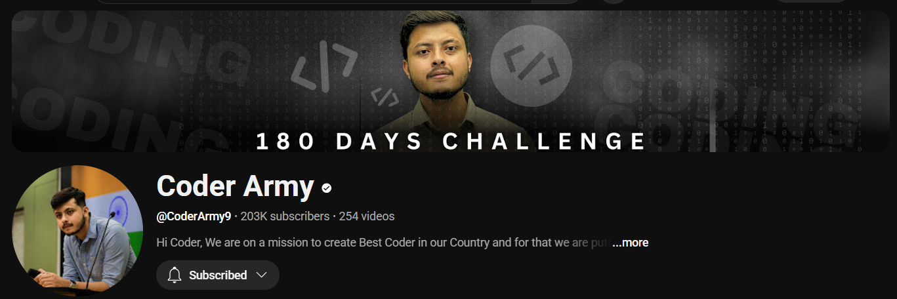

# 🚀 Full Stack Developer Journey  

📚 **Course by:** [Rohit Negi](https://www.youtube.com/watch?v=1pcikNlDB-4&list=PLQEaRBV9gAFsistSzOgnD4cWgFGRVda4X)  
🎯 **Purpose:** Brushing up my development skills through Rohit Negi’s **Defence Course**  
📺 **Channel:**   
🏹 **Why I’m Doing This?**  
I’ve already been into **development & full-stack projects**, but I wanted to **go back to the roots** 🪴 and sharpen my fundamentals.  
This journey is about **discipline + revision + consistency** - just like defence training 💪.

---

## 🗓️ Daily Progress  

### ✅ Day 1 : What is Internet 🌐 
🔗 [Twitter Post 👀](https://x.com/gauravkmaurya09/status/1962591963267641634)  
📚 [How Internet works](https://medium.com/@gauravkmaurya09/how-the-internet-works-a-beginner-friendly-explanation-be334e320aac)
🏹 [How DNS Works](https://medium.com/@gauravkmaurya09/how-dns-works-the-journey-from-a-name-to-an-ip-address-59a59c3a4aab)

**Key Learnings**  
- How the internet works behind the scenes  
- IP Address (ipv4 vs ipv6)  
- DNS (Domain Name System)  
- MAC address  
- Port numbers & their role  
- Client-Server model  
- HTTP vs HTTPS protocols  

---

### ✅ Day 2 : HTML - Basics 🔤  


**Key Learnings**  
- What is HTML
- Headings  
   ```html
   <h1>This is a heading</h1>
   <h3>This is a smaller heading</h3>
   ```  
- Paragraphs  
   ```html
   <p>This is a paragraph.</p>
   ```  
- Line breaks & horizontal rules  
   ```html
   <br>  
   <hr>  
   ```  
- Lists (ordered & unordered)  
   ```html
   <ul>
      <li>Item 1</li>
      <li>Item 2</li>
   </ul>
   ```  
- Anchor tag (links)  
   ```html
   <a href="https://www.example.com" target="_blank">This is a link</a>
   ```  
- Image tag  
   ```html
   
   ```  

---

### ✅ Day 3 : HTML - Tables & Lists 📊  
🔗 [Twitter Post 👀](https://x.com/gauravkmaurya09/status/1963245214463590851)  
**Key Learnings**  
- Nested lists  
- Tables with **colspan** & **rowspan**  
```html
<!-- Table Example -->
<table>
   <thead>
      <tr>
         <th>Header 1</th>
         <th>Header 2</th>
      </tr>
   </thead>
   <tbody>
      <tr>
         <td>Data 1</td>
         <td>Data 2</td>
      </tr>
   </tbody>
   <tfoot>
   </tfoot>
</table>
```


### ✅ Day 4 : HTML - File Path | BoilerPlate Code | DIV + Class + ID + Header + Footer + Main  
🔗 [Twitter Post 👀](https://x.com/gauravkmaurya09/status/1963595689025224831)  
**Key Learnings**  
- File paths: absolute vs relative  
- Boilerplate code for HTML5
- semantic tags: `<header>`, `<footer>`, `<main>`, `<section>`, `<article>`
- `<div>` tag for making containers
- `class` vs `id` attributes


### ✅ Day 5 : HTML - Forms & Input Elements  
🔗 [Twitter Post 👀](https://x.com/gauravkmaurya09/status/1963595689025224831)  
**Key Learnings**  
- Form elements: `<form>`, `<input>`, `<label>`
- Input types: text, password, email, number, date, etc.
- Labels and accessibility
- Form validation (HTML5)


### ✅ Day 6 : HTML - Video, Audio, Iframe
🔗 [Twitter Post 👀](https://x.com/gauravkmaurya09/status/1964597713035768320)
**Key Learnings**
- Embedding videos with `<video>` tag
- Embedding audio with `<audio>` tag
- Using `<iframe>` to embed external content